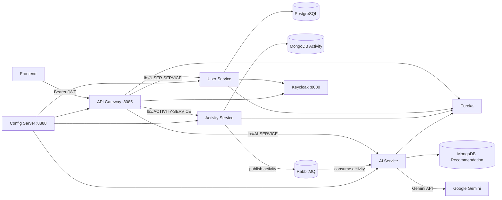

# Fitness AI Microservices (Backend)

Demo video: <https://YOUR_DEMO_VIDEO_LINK_HERE>

AI-powered fitness backend built with Spring Boot microservices (service discovery + centralized config), Keycloak authentication, RabbitMQ messaging, and PostgreSQL/MongoDB persistence.

## Overview

This project solves the common problem of **turning raw fitness activity logs into actionable coaching**. Most apps can record workouts (type, duration, calories, metrics), but users often don’t know what to do next. This backend:

- tracks activities per user,
- asynchronously generates AI-driven feedback and next-workout suggestions,
- and stores those recommendations so the frontend can show them instantly.

It’s built as a microservices system to keep **activity tracking, user management, and AI processing** independently scalable and deployable.

## Services

| Service | Purpose | Port (host) |
|---|---|---:|
| `config-server` | Centralized configuration (Spring Cloud Config, `native` profile) | `8888` |
| `eureka-server` | Service discovery (Netflix Eureka) | `8761` |
| `gateway` | API gateway (Spring Cloud Gateway + JWT Resource Server) | `8085` |
| `userservice` | User profiles + registration (PostgreSQL + Keycloak Admin client) | `8084` |
| `activityservice` | Activity tracking (MongoDB) + publish activity to RabbitMQ | _internal_ |
| `aiservice` | Consume activity events, call Gemini API, store recommendations (MongoDB) | _internal_ |
| `keycloak` | Authentication/authorization (realm import on startup) | `8080` |
| `rabbitmq` | Event bus (management UI enabled) | `15672` |
| `postgres-user` | User DB (PostgreSQL) | `5433` |
| `mongodb-activity` | Activity DB (MongoDB) | `27017` |
| `mongodb-recommendation` | Recommendations DB (MongoDB) | `27018` |

> Note: `activityservice` and `aiservice` run on ports `8082` and `8083` inside Docker, but are not published to the host. Access them through the API Gateway.

## Architecture (high level)



## Key behavior

- **JWT validation at the Gateway**: the gateway is configured as a Resource Server and validates incoming `Authorization: Bearer ...` tokens against Keycloak.
- **User context propagation**: the gateway extracts the `sub` claim from the JWT and injects it into downstream requests as `X-User-Id`.
  - `activityservice` endpoints expect `X-User-Id` (normally provided by the gateway).
- **Async AI pipeline**:
  1. `activityservice` stores the activity in MongoDB
  2. publishes the activity to RabbitMQ (`fitness.exchange` / `activity.queue`)
  3. `aiservice` consumes the message, calls Gemini, parses the response into structured fields, and stores the generated recommendation in MongoDB

Implementation pointers (code):

- Publish activity event: `activityservice/src/main/java/.../service/ActivityService.java`
- Consume activity event: `aiservice/src/main/java/.../service/ActivityMessageListener.java`
- Gemini prompt + response parsing: `aiservice/src/main/java/.../service/ActivityAiService.java`

## Configuration

This repo uses **Spring Cloud Config Server** (`native` profile). Service configuration lives in:

- `config-server/src/main/resources/config/*.yaml`

Services import config from `http://config-server:8888` (see each service `src/main/resources/application.yaml`).

## Local development (Docker Compose)

### Prerequisites

- Docker Desktop (or Docker Engine) with `docker compose`

### 1) Create your environment file

From `fitness-backend/`:

- Copy `.env.example` to `.env`
- Set at minimum `GEMINI_API_KEY`

### 2) Build service JARs (required)

The service Dockerfiles expect a pre-built JAR in `target/`.

PowerShell (Windows):

```powershell
cd fitness-backend
Copy-Item .env.example .env

$services = @("config-server","eureka","gateway","userservice","activityservice","aiservice")
foreach ($s in $services) {
  Push-Location $s
  .\mvnw.cmd -DskipTests clean package
  Pop-Location
}
```

### 3) Start the full stack

```powershell
cd fitness-backend
docker compose up -d --build
```

### Useful URLs

- API Gateway: <http://localhost:8085>
- Eureka dashboard: <http://localhost:8761>
- Config Server health: <http://localhost:8888/actuator/health>
- Keycloak Admin Console: <http://localhost:8080> (credentials from `.env`)
- RabbitMQ Management: <http://localhost:15672> (credentials from `.env`)

### Stop everything

```powershell
cd fitness-backend
docker compose down
```

## Authentication (Keycloak)

`docker-compose.yml` starts Keycloak with `--import-realm` and mounts:

- `keycloak/fitness-realm-realm.json` (realm export)

Realm: `fitness-realm`

Clients (from realm export):
- `fitness-frontend` (SPA)
- `fitness-user-service` (service client for user provisioning)

Recommended dev flow:
- Start the frontend (`fitness-frontend`) and sign in via Keycloak.
- Use the access token from the frontend when calling the gateway APIs.

## API overview (via Gateway)

Base URL: <http://localhost:8085>

### Users

- `POST /api/users/register` (public)
- `GET /api/users/profile/{userId}` (secured)

### Activities

- `GET /api/activities` (secured; uses `X-User-Id` injected by gateway)
- `GET /api/activities/{activityId}` (secured)
- `POST /api/activities` (secured)

### Recommendations

- `GET /api/recommendations/user/{userId}` (secured)
- `GET /api/recommendations/activity/{activityId}` (secured)

## Security & production notes

- Do not hardcode secrets in code/config. Use environment variables or a secrets manager (Vault/KMS/Kubernetes secrets).
- Rotate any keys/passwords used for demos.
- Terminate TLS at the edge (gateway / ingress) and use HTTPS for Keycloak and APIs in production.

## Repo layout

- `activityservice/` – Activity tracking + RabbitMQ publisher
- `aiservice/` – RabbitMQ consumer + Gemini client + recommendation storage
- `userservice/` – User profiles + Keycloak user provisioning + PostgreSQL
- `gateway/` – Edge routing + JWT validation + `X-User-Id` injection
- `config-server/` – Central config (`native` configs under `resources/config`)
- `eureka/` – Service discovery server
- `keycloak/` – Realm export files imported by Keycloak container
- `docker-compose.yml` – Local stack orchestration (DBs, infra, services)
